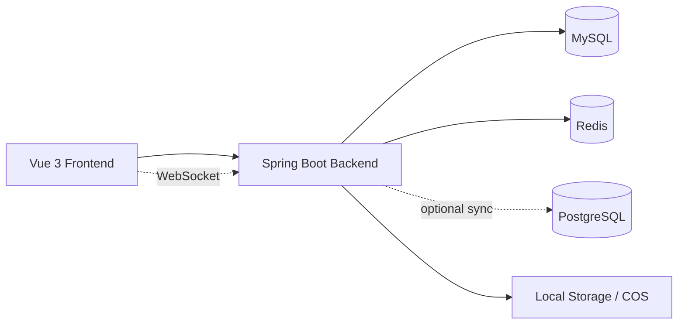

# 输电通道云图库

> Transmission Cloud Gallery
>
> 一个面向输电通道场景的企业级智能云图库平台，支持公共图库、私有空间、团队空间、批量处理、空间分析和协同编辑。

## 项目简介

输电通道场景中的图像资产通常同时面临这些问题：来源分散、数据量大、检索效率低、团队协作成本高、空间权限复杂、分析维度不足。

这个项目围绕上述问题，提供了一套从图片上传、管理、审核、分析到团队协作的完整解决方案，适合用于输电通道巡检图片、设备影像资料、外部采集图像数据的统一管理与业务扩展。

## 项目亮点

- 多空间模型：支持公共图库、私有空间、团队空间三种资源隔离模式
- 图片处理完整：支持本地上传、URL 导入、批量采集、批量编辑、颜色检索
- 团队协同能力：基于 WebSocket 实现多人实时协同编辑
- 管理闭环清晰：包含用户管理、图片审核、空间成员权限控制、分析看板
- 数据同步能力：支持 PostgreSQL -> MySQL 图像数据同步，方便对接外部采集系统
- 可扩展性预留：后端已预留分表和扩展能力，可继续支撑更大规模图库数据

## 核心功能

- 用户注册、登录、个人资料维护
- 图片上传、URL 上传、批量采集与批量编辑
- 图片详情展示、颜色搜索、标签分类与审核流程
- 私有空间 / 团队空间创建、成员管理、权限控制
- 空间使用分析、分类分析、标签分析、成员分析、排行分析
- WebSocket 实时协同编辑
- PostgreSQL 图像数据同步到 MySQL

## 技术架构



## 技术栈

| 层级 | 技术 |
| --- | --- |
| 前端 | Vue 3、TypeScript、Vite、Pinia、Vue Router、Ant Design Vue、ECharts |
| 后端 | Spring Boot、MyBatis-Plus、Sa-Token、WebSocket、Caffeine |
| 数据与存储 | MySQL、Redis、PostgreSQL、ShardingSphere、本地文件存储 / COS |
| 其他 | OpenAPI、Knife4j、Axios |

## 适用场景

- 输电通道巡检图片统一归档与检索
- 团队图像标注、筛选、审核与协作编辑
- 外部采集系统图像数据接入与同步管理
- 面向企业内部的图库管理平台或二次开发底座

## 快速开始

### 1. 环境准备

- JDK 17
- Maven 3.9+
- Node.js 18+
- MySQL 8.x
- Redis 6.x+
- PostgreSQL 14+（仅在使用图像同步功能时需要）

### 2. 初始化数据库

先创建并导入 MySQL 数据库：

```sql
-- 文件位置
cloud-gallery-backend/sql/create_table.sql
```

默认数据库名为 `cloud_gallery`。

### 3. 启动后端

```bash
cd cloud-gallery-backend
mvn spring-boot:run
```

后端默认地址：

- 服务地址：`http://localhost:8123`
- API 前缀：`/api`
- 接口文档：`http://localhost:8123/api/doc.html`

### 4. 启动前端

```bash
cd cloud-gallery-frontend
npm install
npm run dev
```

前端默认开发地址通常为：

- `http://localhost:5173`

### 5. 本地联调说明

当前前端默认直接请求本地后端 `http://localhost:8123`。如果你把前后端部署到其他地址，需要同步调整这些文件中的接口基址：

- `cloud-gallery-frontend/src/request.ts`
- `cloud-gallery-frontend/src/utils/pictureEditWebSocket.ts`
- `cloud-gallery-frontend/src/components/Mars3DViewer.vue`

## 配置说明

后端主配置文件位于：

- `cloud-gallery-backend/src/main/resources/application.yml`

默认会读取以下配置项：

- `MYSQL_URL`
- `MYSQL_USERNAME`
- `MYSQL_PASSWORD`
- `REDIS_HOST`
- `REDIS_PORT`
- `POSTGRES_URL`
- `POSTGRES_USERNAME`
- `POSTGRES_PASSWORD`
- `LOCAL_UPLOAD_URL`

## 使用提示

- 项目默认没有内置管理员种子账号
- 可以先注册普通用户，再在数据库中将该用户的 `userRole` 修改为 `admin`
- PostgreSQL 主要用于图像同步功能，不使用该功能时可不接入对应数据源
- 文件上传默认使用本地存储，后端已预留 COS 接入能力

## 目录结构

```text
.
├─ cloud-gallery-frontend   # Vue 3 前端
├─ cloud-gallery-backend    # Spring Boot 后端
└─ integrated_processor.py  # 图像处理相关辅助脚本
```

## 后续可扩展方向

- 补充 Docker / Docker Compose 一键部署
- 增加 CI、单元测试和接口测试
- 完善对象存储与多环境配置
- 增加首页截图、流程图和演示 GIF

## 仓库说明

如果这个项目对你有帮助，欢迎 Star、Fork 或基于此继续扩展业务能力。
